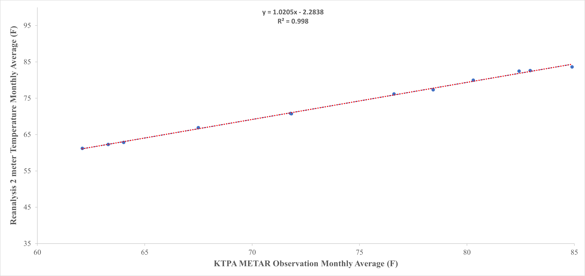

# ERA5 vs. ASOS Temperature Comparison

This directory presents a regression analysis comparing **ERA5 2-meter temperature** data with **KTPA ASOS (METAR)** observations.

The analysis includes hourly comparisons, a 6-hour event window on the day of the 1998 Central Florida Tornado Outbreak, and monthly average climatology.

---

## Data File

- [Reanalysis vs. METAR Temperature Dataset (Excel)](Reanalysis_2mT_KTPA_1998.xlsx)

---

## Plots

### 1. Full Hourly Comparison

- 

### 2. 6-Hour Event Window – 1998-02-23 02:00–08:00 UTC

- 

### 3. Monthly Average Comparison

- 

---

**Reanalysis**: ECMWF ERA5 hourly 2m temperature  
**Observations**: KTPA ASOS (Sourced from Iowa Environmental Mesonet)
