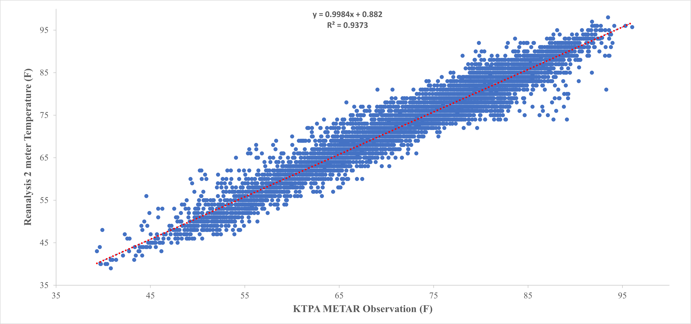
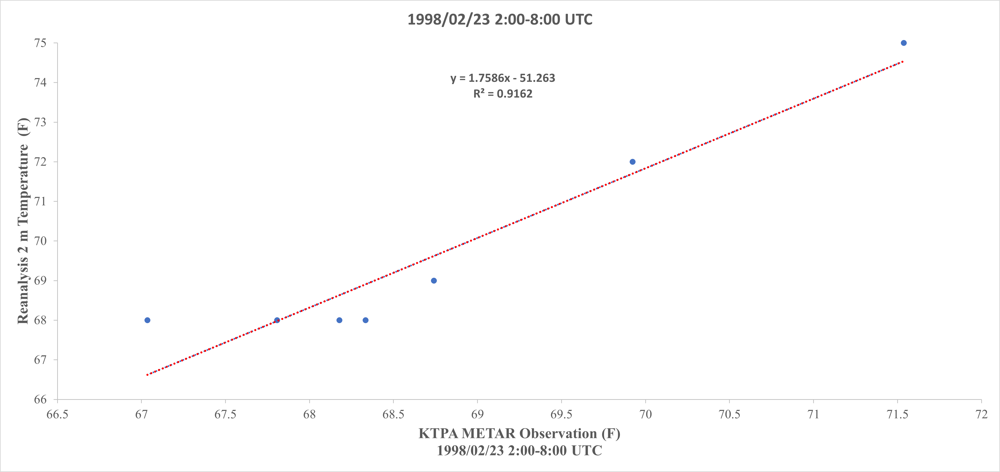

# ERA5 vs. ASOS Temperature Comparison

This directory presents a regression analysis comparing **ERA5 2-meter temperature** data with **KTPA ASOS (METAR)** observations.

The analysis includes hourly data for 1998, a 6-hour event window on the day of the 1998 Central Florida Tornado Outbreak. Missing ASOS values were linearly interpolated using the average of the nearest preceding and following hourly observations.
---

## Data File

- [Reanalysis vs. METAR Temperature Dataset (Excel)](Reanalysis_2mT_KTPA_1998.xlsx)

---

## Plots

### 1. 1998 Hourly

- 

### 2. 6-Hour Event Window

- 

---

**Reanalysis**: ECMWF ERA5 hourly 2m temperature  
**Observations**: KTPA ASOS (Sourced from Iowa Environmental Mesonet)
